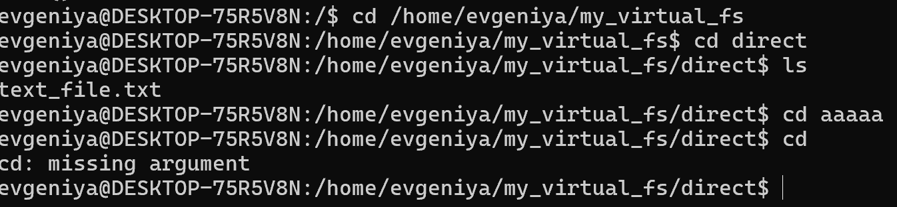
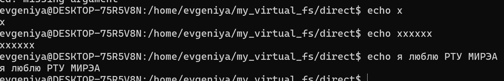
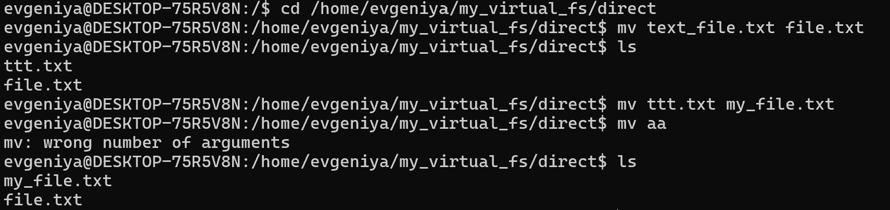

Домашняя работа по конфигурационному управлению №1

Задание

Разработать эмулятор для языка оболочки ОС. Эмулятор должен работать в режиме CLI.Ключами командной строки задаются:
• Имя пользователя для показа в приглашении к вводу.
• Имя компьютера для показа в приглашении к вводу.
• Путь к архиву виртуальной файловой системы.
• Путь к стартовому скрипту.
Необходимо поддержать в эмуляторе команды ls, cd и exit, а также
следующие команды:
1. mv.
2. tac.
3. echo.

Функционал:
Метод _extract_vfs распаковывает файловую систему из архива .tar в каталог /tmp/virtual_fs.
Метод _get_prompt формирует строку приглашения на основе имени пользователя, имени хоста и текущего каталога.
Обработка команд:
_ls: выводит список файлов и папок в текущем каталоге.
_cd: изменяет текущий каталог, если указанный путь существует.
_mv: перемещает или переименовывает файл/папку.
_echo: выводит переданный текст.
_tac: выводит содержимое файла в обратном порядке строк.
_exit: завершает выполнение эмулятора.

Метод run сначала выполняет команды из скрипта, если он указан, затем запускает бесконечный цикл обработки ввода пользователя. Пользователь вводит команды, которые интерпретируются и выполняются.

Тестирование:
cd / ls

echo

mv / ls
