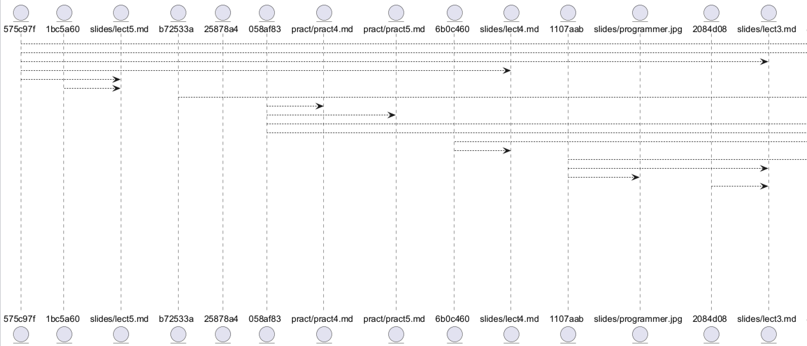

Домашнее задание по конфигурационному управлению №2

Разработать инструмент командной строки для визуализации графа
зависимостей, включая транзитивные зависимости. Зависимости определяются для git-репозитория. Для описания графа
зависимостей используется представление PlantUML. Визуализатор должен
выводить результат на экран в виде графического изображения графа.

Запуск программы
В качестве аргументов запуска указывается файл py, путь к визуализатору plantuml.jar, путь к анализируему репозиторию и указание дата, с которой рассматриваются новые коммиты.

Тестирование программы

