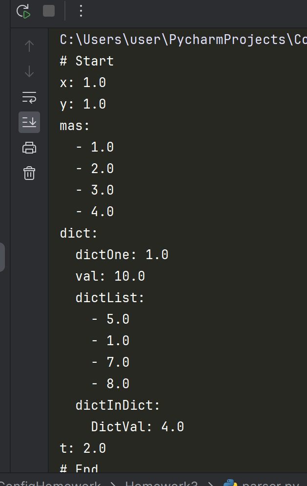

Домашнее задание по конфигурационному управлению №3

Тестирование программы на file1:

Описание:
Реализованна программа-парсер учебного конфигурационного языка в язык yaml. Главная функция - парсер parse_config; функция отслеживает объявление переменных.

Функция parse_array проверяет, является ли переменная массивом и вычленяет его элементы. 

Функция dict_check проверяет, находимся ли мы в словаре.

Функция evaluate_constant вычисляет константу на этапе трансляции.

Запуск:

В main прописывается имя/путь к тестовому файлу на конфигурационном языке.