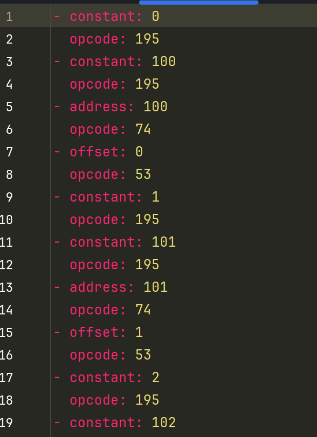

Домашнее задание по конфигурационному управлению #4

Задание

Разработать ассемблер и интерпретатор для учебной виртуальной машины
(УВМ). Форматом для файла-лога и файла-результата является yaml. Выполнить поэлементно операцию побитовое "или" над двумя векторами
длины 7. Результат записать в первый вектор.

Запуск

Запускается с командной строки сначала интерпретатор (параметры: py файл, выходной бинарный файл, результирующий файл в формате yaml), потом ассемблер (параметры: py файл, тестовая программа, лог файл с резульатом на yaml )

Тестирование
