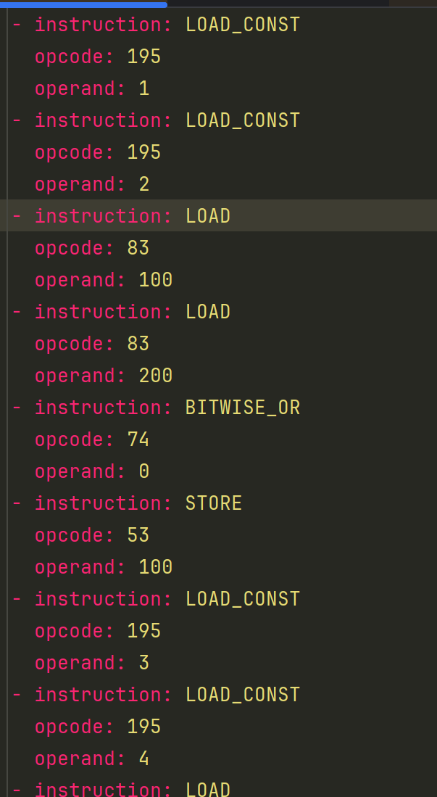

Домашнее задание по конфигурационному управлению #4

Задание

Разработать ассемблер и интерпретатор для учебной виртуальной машины
(УВМ). Форматом для файла-лога и файла-результата является yaml. Выполнить поэлементно операцию побитовое "или" над двумя векторами
длины 7. Результат записать в первый вектор.

Запуск

1. Ассемблер (входной тестовый набор инструкций выходной бинарный файл, выходной лог файл)
2. Интерпретатор (входной бинарный файл, выходной лог-файл)

Тестирование

Файл на выходе ассемблера

Файл на выходе интерпретатора

